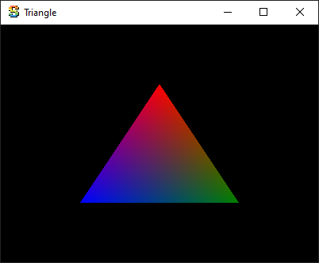

# sokol-cs

Automatically updated C# bindings for sokol https://github.com/floooh/sokol with native dynamic link libraries.

To learn more about `sokol` and it's philosophy, see the [*A Tour of `sokol_gfx.h`*](https://floooh.github.io/2017/07/29/sokol-gfx-tour.html) blog post, written Andre Weissflog, the owner of `sokol`. 

## How to use

## From source

1. Download and install [.NET 5](https://dotnet.microsoft.com/download).
2. Fork the repository using GitHub or clone the repository manually with submodules: `git clone --recurse-submodules git@github.com:lithiumtoast/sokol-cs.git`.
3. Build the native library by running `./library.sh` on macOS or Linux and `.\library.sh` on Windows.
3. Add the C# project `./src/cs/production/sokol-cs/sokol-cs.csproj` to your solution:
```xml
<ItemGroup>
    <ProjectReference Include="path/to/sokol-cs/src/cs/production/sokol-cs/sokol-cs.csproj" />
</ItemGroup>
```

Additionally, if at any time you wish to re-generate the bindings, simple run `bash ./bindgen.sh`. Though if you are on Windows, you will need `bash` which can be obtained by installing Windows Subsystem for Linux with Ubuntu.

## Run: "Hello, world!" of computer graphics

The most basic example of rendering a triangle in clip space using your GPU.



### IDE (Visual Studio / Rider)

Run `Sokol.Samples.Triangle`.

### CLI

#### Windows

Build + run: `dotnet run --project .\src\cs\samples\Sokol.Samples.Triangle\Sokol.Samples.Triangle.csproj`

#### macOS/Linux

Build + run: `dotnet run --project ./src/cs/samples/Sokol.Samples.Triangle/Sokol.Samples/Triangle.csproj`

## Run: Native Ahead of Time Compilation with C#

Example of the previous triangle in clip space with native ahead of time compilation (nAOT). Produces a single file executable that is ~1 megabyte. For more information on nAOT see: https://github.com/dotnet/runtimelab/tree/feature/NativeAOT. The property `AheadOfTimeCompilation` is a custom property from my custom MSBuild properties/targets project called [`my-msbuild`](https://github.com/lithiumtoast/my-msbuild) to make native ahead of time compilation just work with minimal effort.

### Windows

1. Build: `dotnet publish .\src\cs\samples\Sokol.Samples.Triangle\Sokol.Samples.Triangle.csproj -r win-x64 -c Release -o .\publish\triangle /p:AheadOfTimeCompilation=true`
2. Run: `.\publish\triangle\Sokol.Samples.Triangle.exe`

### macOS

//TODO

### Ubuntu

//TODO

## Developers: Documentation

For more information on how C# bindings work, see [`C2CS`](https://github.com/lithiumtoast/c2cs), the tool that generates the bindings for `sokol` and other C libraries.

To learn how to use `sokol`, check out the [official C samples](https://github.com/floooh/sokol-samples). You can also find the same examples that run in [your browser](https://floooh.github.io/sokol-html5/index.html). The comments in the [`sokol_gfx.h`](https://github.com/floooh/sokol/blob/master/sokol_gfx.h), [`sokol_app.h`](https://github.com/floooh/sokol/blob/master/sokol_app.h), etc, are also a good reference for documentation.

## Supported Platforms & 3D Graphics APIs

Since `sokol_gfx`, `sokol_app`, etc, are C libraries technically any platform is possible. For a list of supported platforms for .NET 5 see the [RID Catalog](https://docs.microsoft.com/en-us/dotnet/core/rid-catalog).

[`sokol_gfx`](https://github.com/floooh/sokol#sokol_gfxh) converges old and modern graphics APIs to one simple and easy to use API. To learn more about the convergence of modern 3D graphics APIs (such as Metal, DirectX11/12, and WebGPU) and how they compare to legacy APIs (such as OpenGL), see *[A Comparison of Modern Graphics APIs](https://alain.xyz/blog/comparison-of-modern-graphics-apis)* blog written by Alain Galvan, a graphics software engineer.

## NuGet Packages

NuGet packages are not supported and will not be supported. Recommended to fork or use Git submodules instead.

## License

`sokol-cs` is licensed under the MIT license (`MIT`) - see the [LICENSE file](LICENSE) for details.

`sokol` is licensed under the ZLib license (`zlib`) - see https://github.com/floooh/sokol/blob/master/LICENSE for more details.
