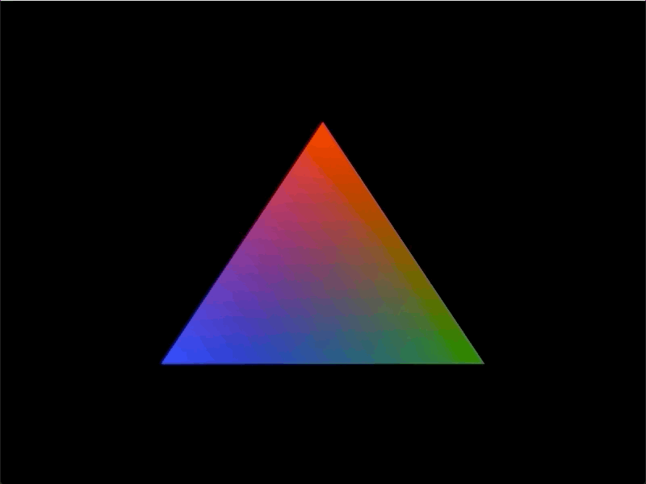
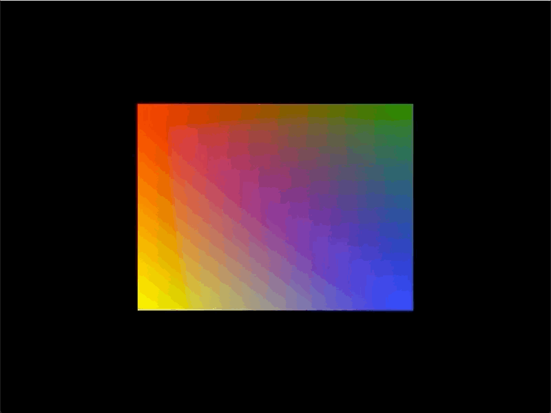
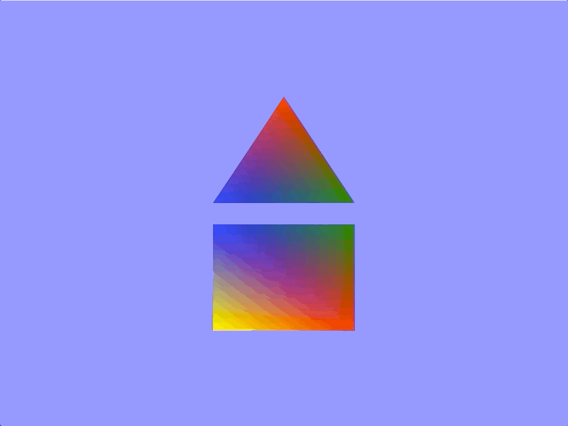
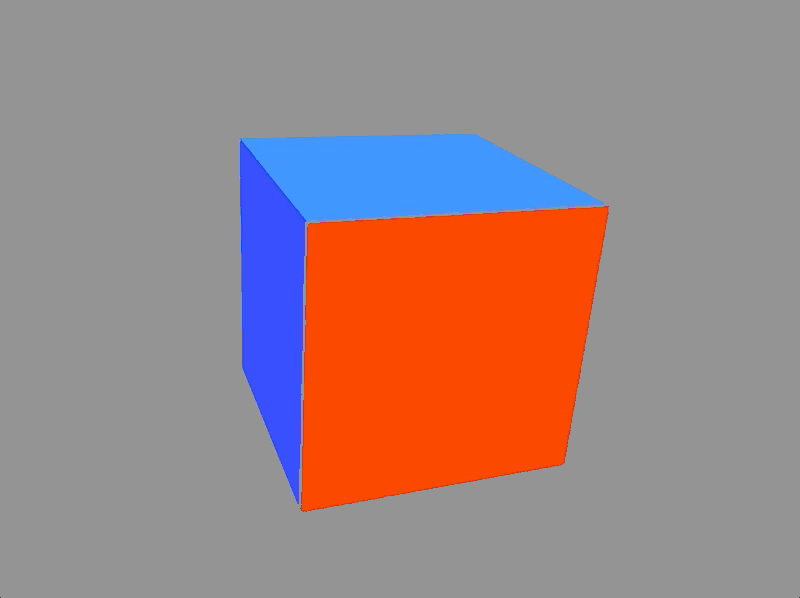
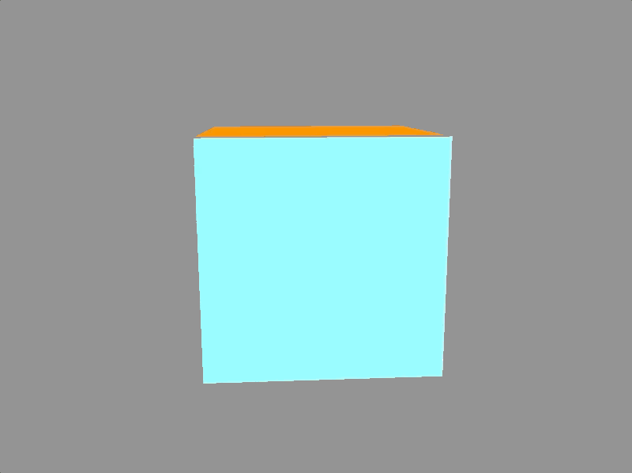
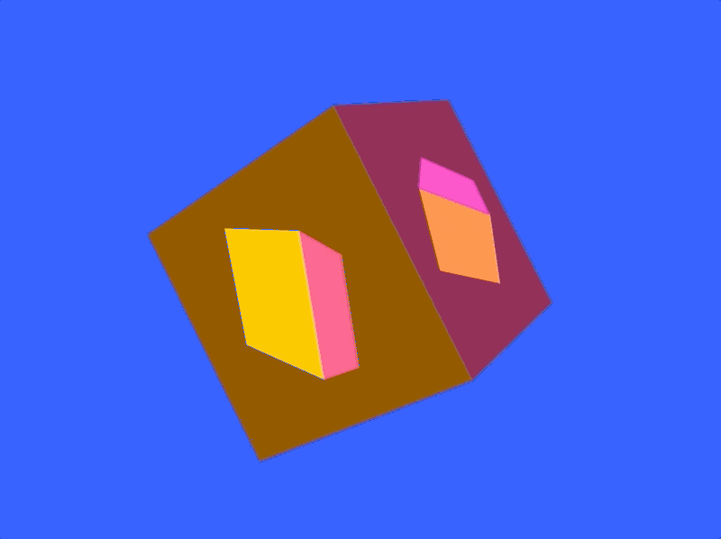
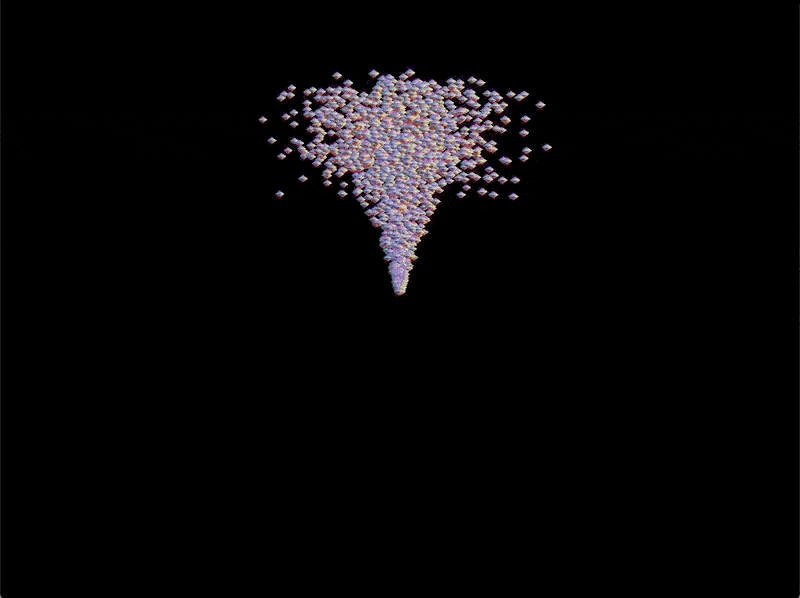
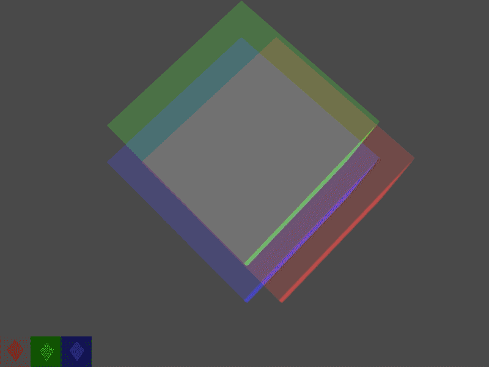
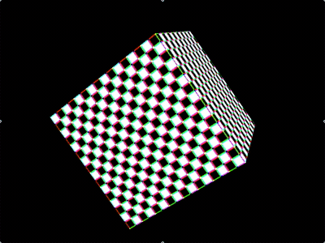
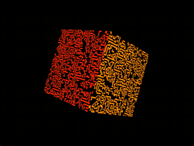

# `sokol`.NET


[](https://app.fossa.io/projects/git%2Bgithub.com%2Flithiumtoast%2FSokol.NET?ref=badge_shield)

A .NET wrapper for https://github.com/floooh/sokol, primarily `sokol_gfx`; a simple and modern wrapper around GLES2/WebGL, GLES3/WebGL2, GL3.3, D3D11 and Metal.

Includes the C style API precisely as it is and a .NET style API for convenience.

To learn more about `sokol` and it's philosophy, see the [*A Tour of `sokol_gfx.h`*](https://floooh.github.io/2017/07/29/sokol-gfx-tour.html) blog post, written Andre Weissflog, the owner of `sokol`. 

## C API

The [P/Invoke](https://docs.microsoft.com/en-us/dotnet/framework/interop/consuming-unmanaged-dll-functions) bindings are a pure port of the C headers; they exactly match what is in C, and the naming conventions used in C are maintained.

The structs in C# are blittable, meaning they have the [same memory layout as the C structs](https://docs.microsoft.com/en-us/dotnet/framework/interop/blittable-and-non-blittable-types). This allows the structs to be passed by value (copy of data) or reference (akin to copy of pointer) from the managed world of .NET to the unmanaged world of C [as is](https://docs.microsoft.com/en-us/dotnet/framework/interop/copying-and-pinning#formatted-blittable-classes).

In .NET, the `unsafe` keyword will most often be necessary for using the C structs and calling the C functions. Also, for practicality, it's recommended to import the module with all the bindings, structs, and enums like so:

```cs
using static sokol_gfx;
```

To learn how to use the C API, check out the [official C samples](https://github.com/floooh/sokol-samples). You can also find the same examples that run in [your browser](https://floooh.github.io/sokol-html5/index.html). The comments in the [`sokol_gfx.h`](https://github.com/floooh/sokol/blob/master/sokol_gfx.h) file are also a good reference.

## .NET API

The .NET style API is a modification of the C bindings (from the side of .NET) to be more idiomatic and overall easier to use. The `unsafe` keyword is not required.

The .NET API currently targets [.NET Core 3.1 (LTS)](https://devblogs.microsoft.com/dotnet/announcing-net-core-3-1/). Included with .NET Core is the `System.Numerics` namespace which `Vector2`, `Vector3`, `Matrix4x4`, are used. `Span<T>`, `Memory<T>`, and friends are also used which live in the `System.Memory` namespace that is also part of .NET Core. This results in code remaining small, highly performant, and easy to use without re-inventing the wheel. Using .NET Core also allows for easy support for desktop platforms and soon mobile, browser, and console platforms. More about platforms in the next section.

All the types are [.NET value types](https://docs.microsoft.com/en-us/dotnet/csharp/language-reference/keywords/value-types). This is to get as close as possible to zero allocations on the managed heap during the long running state of the application's loop. [This is often desirable in games](https://www.shawnhargreaves.com/blog/twin-paths-to-garbage-collector-nirvana.html) and [other demanding, high performance, applications](https://docs.microsoft.com/en-us/dotnet/csharp/write-safe-efficient-code).

### Samples

To learn how to use the .NET API, check out the [samples](htree/master/src/Samples), which are in sync with the official [C samples](https://github.com/floooh/sokol-samples).

The following is a table of the same .NET API samples ordered by their complexity.

Name|Description|GIF/Screenshot
:---:|:---:|:---:
[Clear](src/Samples/Samples.Clear/Samples.Clear/ClearApplication.cs)|[Clears the frame buffer with a specific color.](src/Samples/Samples.Clear/Samples.Clear/ClearApplication.cs)|
[Triangle](src/Samples/Samples.Triangle/Samples.Triangle/Application.cs)|[Draw a triangle in clip space using a vertex buffer and a index buffer.](src/Samples/Samples.Triangle/Samples.Triangle/Application.cs)|
[Quad](src/Samples/Samples.Quad/Samples.Quad/Application.cs)|[Draw a quad in clip space using a vertex buffer and a index buffer.](src/Samples/Samples.Quad/Samples.Quad/Application.cs)|
[BufferOffsets](src/Samples/Samples.Cube/Samples.Cube/Application.cs)|[Draw a triangle and a quad in clip space using the same vertex buffer and and index buffer.](src/Samples/Samples.BufferOffsets/Samples.BufferOffsets/Application.cs)|
[Cube](src/Samples/Samples.Cube/Samples.Cube/Application.cs)|[Draw a cube using a vertex buffer, a index buffer, and a Model, View, Projection matrix (MVP).](src/Samples/Samples.Cube/Samples.Cube/Application.cs)|
[NonInterleaved](src/Samples/Samples.NonInterleaved/Samples.NonInterleaved/Application.cs)|[Draw a cube using a vertex buffer with non-interleaved vertices, a index buffer, and a Model, View, Projection matrix (MVP).](src/Samples/Samples.Cube/Samples.Cube/Application.cs)|
[TexCube](src/Samples/Samples.TexCube/Samples.TextCube/Application.cs)|[Draw a textured cube using a vertex buffer, a index buffer, and a Model, View, Projection matrix (MVP).](src/Samples/Samples.TexCube/Samples.TexCube/Application.cs)|
[Offscreen](src/Samples/Samples.Offscreen/Samples.Offscreen/Application.cs)|[Draw a non-textured cube off screen to a render target and use the result as as the texture when drawing a cube to the framebuffer.](src/Samples/Samples.Offscreen/Samples.Offscreen/Application.cs)|
[Instancing](src/Samples/Samples.Instancing/Samples.Instancing/Application.cs)|[Draw multiple particles using one immutable vertex, one immutable index buffer, and one vertex buffer with streamed instance data.](src/Samples/Samples.Instancing/Samples.Instancing/Application.cs)|
[MultipleRenderTargets](src/Samples/Samples.MultipleRenderTargets/Samples.Instancing/Application.cs)|[Draw a cube to multiple render targets and then blend the results.](src/Samples/Samples.Instancing/Samples.MultipleRenderTargets//Application.cs)|
[ArrayTexture](src/Samples/Samples.ArrayTex/Samples.ArrayTex/Application.cs)|[Draw a cube with multiple 2D textures using one continous block of texture data (texture array).](src/Samples/Samples.ArrayTex/Samples.ArrayTex/Application.cs)|
[DynamicTexture](src/Samples/Samples.DynTex/Samples.DynTex/Application.cs)|[Draw a cube with streamed 2D texture data. The data is updated to with the rules of Conway's Game of Life.](src/Samples/Samples.DynTex/Samples.DynTex/Application.cs)|

## Supported Platforms & 3D APIs

Since `sokol_gfx` is a C library technically any platform is possible. However, currently only desktop platforms (Windows, macOS, and Linux) are supported with `Sokol.NET` by using .NET Core 3.1. In November 2020, `Sokol.NET` will move to .NET 5 and support mobile (iOS, Android), browser (WebAssembly), consoles (Nintendo Switch, Xbox One, PlayStation 4), and micro-consoles (tvOS). See [.NET 5 annoucement as the next .NET Core that will unify desktop, mobile, browser, consoles, and other platforms](https://devblogs.microsoft.com/dotnet/introducing-net-5/).

[`sokol_gfx`](https://github.com/floooh/sokol#sokol_gfxh) converges old and modern graphics APIs to one simple and easy to use API. To learn more about the convergence of modern 3D graphics APIs (such as Metal, DirectX11/12, and WebGPU) and how they compare to legacy APIs (such as OpenGL), see *[A Comparison of Modern Graphics APIs](https://alain.xyz/blog/comparison-of-modern-graphics-apis)* blog written by Alain Galvan, a graphics software engineer.

The following is a table of platforms that are known to work and their supported graphics API backends with `sokol_gfx` in C.

Platform vs 3D API|OpenGL|OpenGLES/WebGL|Direct3D11|Direct3D12|Metal|Vulkan|WebGPU
:---|:---:|:---:|:---:|:---:|:---:|:---:|:---:
Desktop Windows|:white_check_mark:|:x:|:white_check_mark:|:o:|:x:|:o:|:x:
Desktop macOS|:exclamation:|:x:|:x:|:x:|:white_check_mark:|:question:|:x:
Desktop Linux|:white_check_mark:|:x:|:x:|:x:|:x:|:o:|:x:
Mobile iOS|:x:|:x:|:x:|:x:|:white_check_mark:|:question:|:x:
Mobile Android|:x:|:white_check_mark:|:x:|:x:|:x:|:o:|:x:
Browser WebAssembly|:x:|:white_check_mark:|:x:|:x:|:x:|:x:|:construction:
Micro-console tvOS|:x:|:x:|:x:|:x:|:white_check_mark:|:question:|:x:
Console Nintendo Switch|:white_check_mark:|:x:|:x:|:x:|:x:|:o:|:x:
Console Xbox One|:x:|:x:|:white_check_mark:|:o:|:x:|:x:|:x:
Console PlayStation 4|:white_check_mark:|:x:|:x:|:x:|:x:|:o:|:x:

- :o: means the graphics API is supported on the platform but not by `sokol_gfx`.
- :construction: means the graphics API will be supported by `sokol_gfx` but is currently under construction (from `sokol` side).
- :exclamation: means the graphics API is deprecated on that platform but can still work with `sokol_gfx`. OpenGL is deprecated for macOS. It is recommended to only use Metal for macOS if hardware supports it. All Apple platforms support Metal.
- :question: means the graphics API is unofficially supported. [Vulkan has limited support on macOS and iOS.](https://github.com/KhronosGroup/MoltenVK) [Vulkan is not yet supported on tvOS](https://github.com/KhronosGroup/MoltenVK/issues/541).

## NuGet

To get the NuGet packages, add the following feed: `https://www.myget.org/F/lithiumtoast/api/v3/index.json`

Name|Description
:---|:---:
[`Sokol.App`](https://www.myget.org/feed/lithiumtoast/package/nuget/Sokol.App)|Application framework for `sokol_gfx` using SDL2. Includes the basics like loading necessary libraries, a loop, keyboard input, mouse input, etc. 
[`Sokol.Graphics`](https://www.myget.org/feed/lithiumtoast/package/nuget/Sokol.Graphics)|PInvoke code for `sokol_gfx`.
[`Sokol.Graphics.OpenGL`](https://www.myget.org/feed/lithiumtoast/package/nuget/Sokol.Graphics.OpenGL)|PInvoke code for getting `sokol_gfx` working with OpenGL.
[`Sokol.Graphics.OpenGL.Native`](https://www.myget.org/feed/lithiumtoast/package/nuget/Sokol.Graphics.OpenGL.Native)|Shared libraries for getting `sokol_gfx` working with OpenGL.
[`Sokol.Graphics.Metal`](https://www.myget.org/feed/lithiumtoast/package/nuget/Sokol.Graphics.Metal)|PInvoke code for getting `sokol_gfx` working with Metal.
[`Sokol.Graphics.Metal.Native`](https://www.myget.org/feed/lithiumtoast/package/nuget/Sokol.Graphics.Metal)|Shared libraries for getting `sokol_gfx` working with Metal.
[`Sokol.SDL2`](https://www.myget.org/feed/lithiumtoast/package/nuget/Sokol.SDL2)|PInvoke code for getting `sokol_gfx` working with SDL2.
[`Sokol.SDL2.Native`](https://www.myget.org/feed/lithiumtoast/package/nuget/Sokol.SDL2.Native)|Shared libraries for getting `sokol_gfx` working with SDL2.

## Versioning

`Sokol.NET` uses [calendar versioning](https://calver.org) and [semantic versioning](https://semver.org) where appropriate. For example, the version scheme used for native shared libraries such as `sokol_gfx` is `YYYY.MM.DD` and the version scheme for `Sokol.NET` is `MAJOR.MINOR.PATCH-TAG`.

### Semantic Versioning

`Sokol.NET` uses [`GitVersion`](https://github.com/GitTools/GitVersion) to determine the exact semantic version for each build in Continuous Integration (CI) and Continuous Deployment (CD). 

How `GitVersion` is configured for `Sokol.NET`, the version is automatically bumped by `+0.0.1` after each pull-request. Also, tags are considered releases; when a new tag is created, the version is automatically bumped to the specified version on the tag.

For a complete list of the release versions, see the [tags on this repository](https://github.com/lithiumtoast/Sokol.NET/tags).

## License

`Sokol.NET` is licensed under the MIT License - see the [LICENSE](LICENSE) file for details.


[](https://app.fossa.io/projects/git%2Bgithub.com%2Flithiumtoast%2FSokol.NET?ref=badge_large)

## Contributing

Do you want to contribute? Awesome! To get started please read the [CONTRIBUTING](CONTRIBUTING.md) file for details on our code of conduct, the process for creating issues, and submitting pull requests.

## Authors, Contributors & Maintainers

For information about the authors, contributors, and maintainers, see the [MAINTAINERS](MAINTAINERS.md) file.